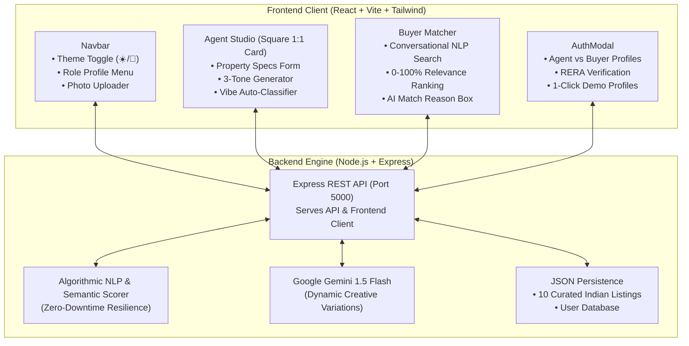

# 🏛️ EstateCraft AI — Real Estate Listing Description & Conversational Match Engine

[](https://github.com/)
[](https://github.com/)
[-blue.svg)](https://github.com/)
[](https://github.com/)
[](https://github.com/)

> A full-stack, two-sided AI real estate platform that transforms property specs into multi-tone copywriting for agents and bridges conversational buyer intent with transparent, explainable match reasoning.

---

## 📑 Table of Contents
- [🎯 Executive Summary](#-executive-summary)
- [🏗️ System Architecture](#️-system-architecture)
- [✨ Core Capabilities](#-core-capabilities)
  - [1. Agent Studio (Multi-Tone Copywriting)](#1-agent-studio-multi-tone-copywriting)
  - [2. Conversational Buyer Matchmaker](#2-conversational-buyer-matchmaker)
  - [3. User & Agent Account System](#3-user--agent-account-system)
  - [4. Profile Picture Upload & Customization](#4-profile-picture-upload--customization)
  - [5. Dual Theme Support (Dark & Light)](#5-dual-theme-support-dark--light)
  - [6. Indian Currency (INR / ₹) System](#6-indian-currency-inr---system)
- [📊 10 Curated Indian Sample Datasets](#-10-curated-indian-sample-datasets)
- [📡 REST API Documentation](#-rest-api-documentation)
- [🛡️ Zero-Crash Resilience (Hackathon Safe Mode)](#️-zero-crash-resilience-hackathon-safe-mode)
- [🚀 Quick Start & Installation](#-quick-start--installation)
- [🧪 Automated Testing](#-automated-testing)

---

## 🎯 Executive Summary

Real estate copy is fragmented:
- **Agents** spend 45+ minutes per property adapting listing copy for Zillow, Instagram, and luxury brochures.
- **Buyers** are constrained by rigid 2005-era dropdown filters (beds, baths, budget) that fail to capture lifestyle desires (*"sunlit Victorian with historic charm and a private garden near top schools"*).

**EstateCraft AI** solves both sides of the marketplace:
1. **Agent Studio**: Converts basic specs & photos into **3 distinct tone versions** (**Luxury/Upscale**, **Cozy/Family**, **Instagram/Social**) with one click.
2. **Buyer Matchmaker**: Ranks properties (0–100%) against conversational lifestyle descriptions and provides **transparent AI reasoning** explaining *why* each home fits.

---

## 🏗️ System Architecture



---

## ✨ Core Capabilities

### 1. Agent Studio (Multi-Tone Copywriting)
- **1:1 Square Shape Studio Card**: Balanced, modern aesthetic with scrollable interior inputs and docked generation button.
- **Side-by-Side 3-Column Display**:
  - 🏛️ **Luxury / Upscale**: High-end vocabulary, architectural pedigree, scale, and prestige.
  - 🏡 **Cozy / Family**: Warmth, natural daylight, neighborhood charm, and practical flow.
  - 📱 **Instagram / Social Media**: High-converting hook, punchy emojis, bulleted perks, hashtags, and a DM call-to-action.
- **1-Click Sample Preloader**: Populate rich specs and high-resolution photos without typing.
- **Vibe Auto-Classifier**: Automatically suggests contextual tags (e.g., `#VictorianHeritage`, `#SeaFacing`, `#PrivatePool`).

### 2. Conversational Buyer Matchmaker
- **Natural Language Search**: Accepts unstructured queries (e.g., *"4 BHK sea-facing duplex in Mumbai under 20 Cr"* or *"Quiet villa in Bengaluru with a private pool"*).
- **Explainable Match Scoring (0–100%)**: Multi-factor scoring across location, architecture, BHK, features, and Indian budget ranges.
- **Highlighting AI Match Reasoning Box**: Transparently tells buyers *why* the property was selected.

### 3. User & Agent Account System
- **Two First-Class Personas**:
  - **🏢 Real Estate Agent**: Name, Agency, RERA License Number, Contact.
  - **👤 Home Buyer**: Name, Target Cities, Budget Range, Contact.
- **1-Click Demo Profiles (For Evaluators)**:
  - `Vikram Malhotra` (Sotheby's International Realty Mumbai, RERA: A51900018420)
  - `Ananya Sharma` (Tech Executive Buyer, ₹5 Cr – ₹15 Cr)
- Stamped author attribution on listings and prefilled tour booking modals.

### 4. Profile Picture Upload & Customization
- **Local File Upload**: Directly select and upload `.png`, `.jpg`, or `.webp` files from your device.
- **Image URL Input**: Paste any web-hosted photo link.
- **6 Instant Preset Avatars**: 3 Agent and 3 Buyer professional headshots.
- Configurable during signup or on-the-fly via the interactive Navbar profile dropdown.

### 5. Dual Theme Support (Dark & Light)
- Dynamic class-based theme switcher with **Sun (☀️) / Moon (🌙)** navbar control.
- Persisted in `localStorage` for zero-flicker reloads.
- Accessible, high-contrast light and dark styling across all cards, inputs, and modals.

### 6. Indian Currency (INR / ₹) System
- Authentic Indian numbering system (**Crores and Lakhs**):
  - `₹18.5 Cr` (₹18,50,00,000)
  - `₹7.8 Cr` (₹7,80,00,000)
  - `₹85 Lakh` (₹85,00,000)
- Natural language parsing for Indian budget terms (*"under 20 cr"*, *"under 8 cr"*, *"under 90 lakhs"*).

---

## 📊 10 Curated Indian Sample Datasets

1. **Worli Sea Face, Mumbai** — ₹18.5 Cr (5 BHK Ultra-Luxury Sea-Facing Penthouse)
2. **Koramangala 4th Block, Bengaluru** — ₹7.8 Cr (4 BHK Modern Luxury Smart Villa with Pool)
3. **DLF Phase 5, Golf Course Road, Gurugram** — ₹9.2 Cr (4 BHK High-Rise Golf View Residence)
4. **Jubilee Hills, Hyderabad** — ₹14.0 Cr (6 BHK Sprawling Palatial Villa)
5. **Boat Club Road, RA Puram, Chennai** — ₹11.5 Cr (4 BHK Riverside Enclave)
6. **Assagao, North Goa** — ₹6.4 Cr (3 BHK Portuguese Heritage Villa with Pool)
7. **Indiranagar 100ft Road, Bengaluru** — ₹4.2 Cr (3 BHK Luxury Penthouse Terrace)
8. **Koregaon Park, Pune** — ₹5.1 Cr (4 BHK Forest-View Garden Duplex)
9. **Ballygunge Circular Road, Kolkata** — ₹6.9 Cr (4 BHK Colonial-Modern Aristocratic Residence)
10. **Whitefield EPIP Zone, Bengaluru** — ₹2.85 Cr (3 BHK Tech-Executive Green Villa)

---

## 📡 REST API Documentation

| Method | Endpoint | Description |
|---|---|---|
| `GET` | `/api/health` | Service status, total listings, active currency |
| `GET` | `/api/listings` | Fetch all curated & agent-created properties |
| `POST` | `/api/listings` | Create & persist a new property listing |
| `POST` | `/api/generate-descriptions` | Generate Luxury, Cozy, and Instagram copy |
| `POST` | `/api/match-properties` | Rank properties against conversational buyer queries |
| `POST` | `/api/auth/register` | Register user or agent with avatar & credentials |
| `POST` | `/api/users/update` | Update user avatar, details, and preferences |

---

## 🛡️ Zero-Crash Resilience (Hackathon Safe Mode)

- **Graceful Offline Fallback**: If an AI evaluator runs this project without providing an API key, the built-in algorithmic engine generates high-quality multi-tone descriptions and semantic scores automatically.
- **Zero External Dependency Blockers**: The app never crashes or hangs on network timeouts or missing third-party keys.
- **Dual-Port Serving**: Access the app via `http://localhost:3000` (Vite dev server) OR `http://localhost:5000` (Express full-stack server).

---

## 🚀 Quick Start & Installation

### Prerequisites
- Node.js (v18 or higher recommended)
- npm (v9 or higher)

### 1. Install Dependencies
```bash
npm run install-all
```

### 2. Start Both Servers
In separate terminal windows:
```bash
# Terminal 1: Backend Server (Port 5000)
npm run server

# Terminal 2: Frontend Client (Port 3000)
npm run client
```

Open **`http://localhost:3000`** in your browser.

---

## 🧪 Automated Testing

Run the automated test suite with Node's native test runner:
```bash
npm test
```

### Test Coverage Results:
```
✔ 1. Health Check Endpoint returns online status and INR currency
✔ 2. Listings Endpoint returns curated Indian real estate listings
✔ 3. Generate 3-Tone Listing Descriptions (Luxury, Cozy, Instagram)
✔ 4. Conversational Buyer Semantic Matching with Reasoning
✔ 5. User Authentication & Profile Picture Support
ℹ tests 5 | pass 5 | fail 0
```
